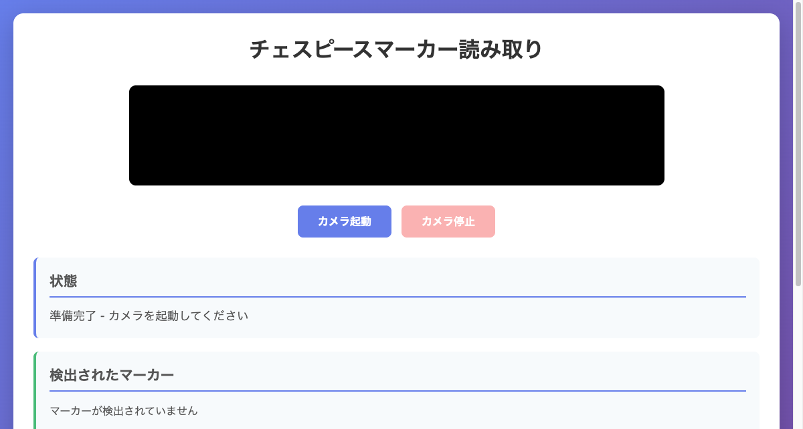
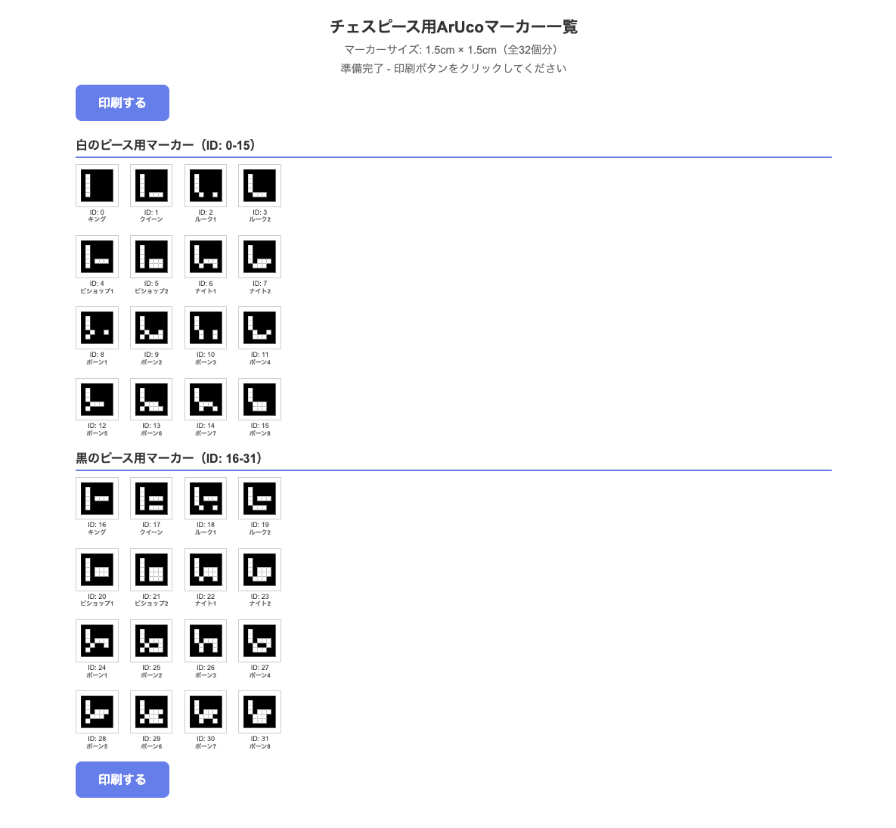
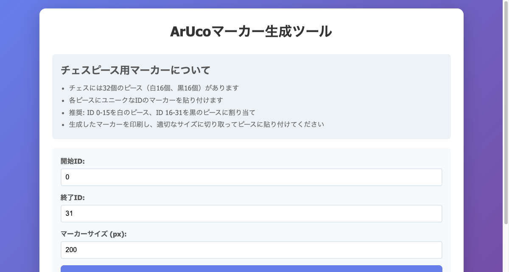

# チェス棋譜自動記録システム - 開発日記

## 2025年12月3日

### プロジェクト開始

チェスのゲームを自動的に記録するシステムの開発を開始。各チェスピースにArUcoマーカーを貼り付け、カメラで読み取ることで盤面の状態を認識し、PGN形式で棋譜を記録することが目標。

### 技術選定

当初はOpenCV.jsを使用していたが、以下の理由でjs-aruco2に切り替えることにした：
- ブラウザでの軽量性
- プロジェクト全体の一貫性
- シンプルなAPI

採用した技術スタック：
- **マーカー検出**: [js-aruco2](https://github.com/damianofalcioni/js-aruco2)
- **マーカー生成**: OpenCV.js (marker-generator.html用)
- **言語**: HTML, CSS, JavaScript
- **マーカー形式**: ArUco (ARUCO辞書, 7×7マーカー)

### js-aruco2のセットアップ

プロジェクトの初期設定を行った。

```bash
# package.jsonの作成
npm init -y

# js-aruco2のインストール
npm install js-aruco2

# 必要なファイルをlibディレクトリにコピー
mkdir -p lib
cp node_modules/js-aruco2/src/cv.js lib/
cp node_modules/js-aruco2/src/aruco.js lib/
```

### 複数マーカー検出機能の実装

`script.js`を作成し、以下の機能を実装：

1. **カメラアクセス**
   - `getUserMedia` APIを使用
   - 背面カメラを優先設定
   - 解像度は1280x720を理想値に

2. **マーカー検出ループ**
   ```javascript
   // ディテクターの初期化
   detector = new AR.Detector();

   // カメラ映像からマーカーを検出
   const imageData = ctx.getImageData(0, 0, canvas.width, canvas.height);
   const markers = detector.detect(imageData);
   ```

3. **検出結果の描画**
   - マーカーの輪郭を赤線で描画
   - 各コーナーに緑色の円を表示
   - マーカーIDを中心に表示

4. **マーカー情報の管理**
   - Map構造でマーカーIDと検出情報を保存
   - 各マーカーの位置（中心座標）と最終検出時刻を記録
   - 3秒以上検出されないマーカーは自動削除
   - アクティブ状態を🟢（1秒以内）/🟡（1-3秒前）で視覚化

完成した検出画面：



### index.htmlの更新

OpenCV.jsからjs-aruco2への切り替えに伴い、script タグを更新：

```html
<script src="lib/cv.js"></script>
<script src="lib/aruco.js"></script>
<script src="script.js"></script>
```

また、ユーザビリティ向上のため、使い方セクションにリンクを追加：
- マーカー生成ツールへのリンク
- 全ピース用マーカー一覧ページへのリンク

### 動作確認

スマートフォンでマーカー検出を試してみた。リアルタイムでマーカーの輪郭（赤線）とIDが表示され、検出されたマーカーの一覧が画面下部に表示される。複数のマーカーを同時に検出できることを確認！


### 全ピース用マーカー一覧ページの作成

チェスには32個のピース（白16個、黒16個）があるため、すべてのピース用のマーカーを一度に印刷できるページを作成することにした。

#### 課題1: マーカー生成方法

最初はOpenCV.jsの`cv.aruco_Dictionary`を使おうとしたが、エラーが発生：

```
エラー: cv.aruco_Dictionary is not a constructor
```

調査の結果、OpenCV.jsのバージョンやビルドによってはArUco機能が含まれていない可能性があることが判明。

**解決策**: js-aruco2を使用してSVG形式でマーカーを生成することにした。

```javascript
const dictionary = new AR.Dictionary('ARUCO');
const svgString = dictionary.generateSVG(id);
```

SVG形式の利点：
- ベクター画像なので拡大縮小しても品質が劣化しない
- 印刷に最適
- ファイルサイズが小さい

#### 課題2: cv.js の依存関係

`AR.Dictionary is not a constructor`というエラーが発生。

**原因**: aruco.js は cv.js に依存しているが、読み込んでいなかった。

**解決策**: HTMLに cv.js の読み込みを追加：

```html
<script src="lib/cv.js"></script>
<script src="lib/aruco.js"></script>
```

これでマーカー生成が正常に動作するようになった！

### チェスピースへの割り当て

32個のマーカーIDを各チェスピースに割り当てた：

**白のピース（ID: 0-15）**
- ID 0: キング
- ID 1: クイーン
- ID 2-3: ルーク1-2
- ID 4-5: ビショップ1-2
- ID 6-7: ナイト1-2
- ID 8-15: ポーン1-8

**黒のピース（ID: 16-31）**
- ID 16: キング
- ID 17: クイーン
- ID 18-19: ルーク1-2
- ID 20-21: ビショップ1-2
- ID 22-23: ナイト1-2
- ID 24-31: ポーン1-8

JavaScriptでピース名のマッピングを作成し、各マーカーの下にIDとピース名を表示するようにした。

### 印刷レイアウトの最適化

#### 課題3: 1ページに収まらない

最初のレイアウトでは、マーカー間の間隔が1cmで、全体が1ページに収まらなかった。

**解決策**:
1. マーカー間隔を縮小
   - 画面表示時: 1cm → 0.4cm
   - 印刷時: 0.3cm

2. ヘッダーとセクションの余白を削減
   ```css
   .header {
       margin-bottom: 10px; /* 元は20px */
   }

   .section {
       margin-bottom: 15px; /* 元は30px */
   }
   ```

3. 印刷時のフォントサイズを調整
   ```css
   @media print {
       body { padding: 5mm; }
       .header h1 { font-size: 1.1em; }
       .section h2 { font-size: 0.9em; }
       .marker-item .marker-label { font-size: 7px; }
       .marker-item .piece-name { font-size: 6px; }
   }
   ```

完成したマーカー一覧ページ。全32個のマーカーが1ページに収まるようになった：



各マーカーには以下が表示される：
- ArUcoマーカー（SVG形式、1.5cm × 1.5cm）
- ID番号
- ピース名（日本語）

### 個別マーカー生成ツールの確認

既存の marker-generator.html も確認。こちらはOpenCV.jsを使用して任意のID範囲のマーカーを生成できる：



機能：
- 開始IDと終了IDを指定
- マーカーサイズのカスタマイズ
- 個別ダウンロード機能

all-markers.html とは異なる用途で使い分けできる。

### ドキュメント整備

開発記録を残すため、docsディレクトリを作成：

```bash
mkdir -p docs/images
```

スクリーンショットを保存：
- `01-index-page.png` - マーカー検出画面
- `02-all-markers-page.png` - 全マーカー一覧
- `03-marker-generator-page.png` - マーカー生成ツール
- `IMG_5091.PNG` - スマホでの実機テスト

README.md と development-log.md（本ファイル）を作成し、プロジェクトの概要と制作過程を記録。

### 今日の成果

✅ 完成した機能：
- js-aruco2による複数マーカーの同時検出
- リアルタイムマーカー認識
- マーカー情報の表示と管理
- 全32ピース用マーカーの一括生成
- チェスピースへの自動割り当て
- 1ページ印刷レイアウト
- プロジェクトドキュメント

### 学んだこと

1. **ライブラリの依存関係**
   - aruco.js が cv.js に依存していることを見落としていた
   - エラーメッセージからライブラリの依存関係を読み解く重要性

2. **SVG vs Canvas**
   - 印刷用途ではSVGの方が品質が良い
   - js-aruco2の`generateSVG`は非常に便利

3. **印刷レイアウトの調整**
   - `@media print`でのCSS調整
   - cm単位での正確なサイズ指定
   - 余白とフォントサイズのバランス

4. **Map構造の活用**
   - マーカー情報の管理にMapを使用
   - IDをキーとして効率的にアクセス

### 次のステップ

🚧 今後実装予定：

1. **盤面認識機能**
   - チェス盤のマス目を検出する
   - マーカーの位置から、どのマス目にピースがあるかを判定
   - 8×8のグリッドマッピング

2. **棋譜記録機能**
   - ピースの移動を検出
   - 棋譜をPGN形式で記録
   - 棋譜のエクスポート機能

3. **UI/UX改善**
   - 盤面の可視化（8×8グリッド表示）
   - 移動履歴の表示
   - 不正な移動の警告
   - 手動補正機能

### 技術メモ

**js-aruco2の主要API**:
```javascript
// ディテクター作成
const detector = new AR.Detector();
const detector = new AR.Detector({ dictionaryName: 'ARUCO' });

// マーカー検出
const markers = detector.detect(imageData);

// マーカーオブジェクトの構造
{
  id: number,           // マーカーID
  corners: [            // 4つのコーナー座標
    {x: number, y: number},
    {x: number, y: number},
    {x: number, y: number},
    {x: number, y: number}
  ]
}

// マーカー生成（SVG）
const dictionary = new AR.Dictionary('ARUCO');
const svgString = dictionary.generateSVG(id);
```

**印刷設定の推奨値**:
- 用紙サイズ: A4
- マーカーサイズ: 1.5cm × 1.5cm
- 印刷品質: 高品質/写真品質推奨
- カラー: モノクロで十分
- 余白: 5mm

### 参考資料

- [js-aruco2 GitHub](https://github.com/damianofalcioni/js-aruco2)
- [js-aruco2 デモ](https://damianofalcioni.github.io/js-aruco2/samples/getusermedia/getusermedia_ARUCO.html)
- [ArUco公式サイト](https://www.uco.es/investiga/grupos/ava/portfolio/aruco/)
- [PGN形式仕様](https://www.chessclub.com/help/PGN-spec)

---

## プロジェクト情報

**開始日**: 2025年12月3日
**現在のフェーズ**: マーカー検出機能完成、盤面認識機能の設計中
**技術スタック**: HTML5, CSS3, JavaScript, js-aruco2
**リポジトリ**: https://github.com/champierre/auto-pgn
